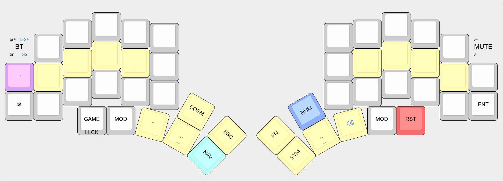
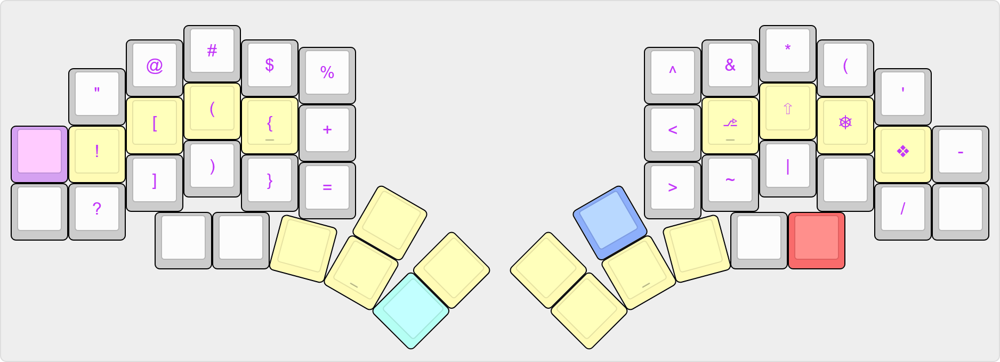

# Kyriel (draft version)

*Kyriel* is an ergonomic split keyboard layout that utilises layers and inspiration from layouts like Seniply, Miryoku and Callum's, but no classic homerow mods.\
While *Kyriel* is mainly meant for my [36+14-key Kyria](https://github.com/splitkb/kyria), it's not difficult to adjust to any other similar keyboard. If yours has fewer thumb keys, some options are described [here](readme/thumbkeys.md).\
With how much thought I put into the layout, *you* are more than welcome to adopt some design ideas in your own personal keymap! ...Or to straight up use this one)

The main use-cases are: programming, writing, light gaming.

For more detailed information on each layer, see below!

## BASE

### ALPHAS

- The base layer is Colemak-DH, but it's trivial to switch it to any other layout, like QWERTY or DVORAK.
- `shift+,` and `shift+.` result in `;` and `:` respectively (like one the German layout) because they're used more often than `<>`.
- Since `-` `_` are used often in programming, the key is on the side column in addition to the actual symbol layer.

### MODIFIERS
- To avoid using homerow mods, the following design contract was met (inspired by Callum-style HMR):
    > "The homerow keys on the same side as the currently held-down layer key always act as modifiers"

    All further layers follow this philosophy.

- To enable using mod+alpha combinations, a thumb key on each hand was dedicated to the otherwise transparent layers only containing the respective modifier keys.  
- `GUI` is on the weakest finger, while `Shift` is between `Ctrl` and `Alt` to make combinations like `Ctrl+Shift`, `Alt+Shift` and `Alt+Shift+Ctrl`. `Ctrl` is on the ring finger position to take tension off the mouse fingers. Changing any of this is trivial.

### THUMB-/SIDEKEYS
- According to my own usage statistics, 12% of all keypresses are `Space`, so there's one for each side
- `Backspace` and `Shift` follow, with 6% each.
- Momentary layer keys should be on the *opposite* hand from where the bulk of the layer's keys are
    - Because `NUM` and `FN` key positions are closely related, they have to be on the same hand
    - `NAV` and `SYM` are most heavily used, so they have to be on opposite hands and on the most accessible row
    - `MOUSE` goes on the opposite side of the mouse hand. `NUM` and `FN` could be mirrored if you need to change the 'dominant hand' side. (funnily enough, `NAV` and `SYM` ended up exactly where they are on the default Kyria layout independently of it)
- The encoders are used for brightness, backlight and volume controls
- `Escape`, `Enter`, `Tab` are also included
- `RST` simply resets to the base layer, and `GAME` either toggles the game layer from base or locks the current layer. These keys are optional.
- Finally, some optional, quicker/one-handed ways to access `Ctrl`, `Alt` (opposite of the mouse hand, for multi-cursor) and `NAV` (for skipping in videos) were added with hold-tap keys.

*Note: the number of thumb-keys can be reduced to anything from 7 to 3 or less per side; [Here](readme/thumbkeys.md), some suggestions are described.*

## LAYERS

### NUM
- This layout tries to optimize the frequency distribution of numbers, but arranging the numbers in the same way as on a traditional numpad is possible too. The justification of this layout and further alternatives are described [here](https://github.com/KaiFireborn/kyriel/blob/keymap/readme/numpads.md#asterisk).
- `+`, `-`, `*`, `/`, `\`, `.`, `<`, `>`, `-` are reflected from their SYM and/or base positions.

### FN
- The function keys are on the same positions as their `NUM` counterparts (plus additional keys)
- Some media keys (rewind, play, skip, eject, backlight toggle, mute) reference positions of similar keys from NAV (e.g. the arrow keys)

### SYM
- Positions of `@#$%^*` resemble the traditional shifted-number character positions, with `!` shifted down for easier access.
- `[({<` and `>})]` are below them for quick typing with one hand, especially when closing brackets get automatically filled in (inspired by *Seniply*)
- Symbols like `'/-` ~~(but not `,.;:`)~~ are reflected from the base layer. Their shifted states `"?` are mirrored to the opposite hand, while `_` replaces space.\
(with this, `?` is also directly under the similar `!`) 
- The similar `|\/` are right next to each other
- `` ` `` is next to the similar `'` for easy LaTeX-style quotation marks
- `+=*-/<>` are reflected in NUM, whereas `+` is in an easier position than `=` because `=` is a more 'deliberate' action.

### COSM

Mostly keys combined with AltGr to send unicode symbols. This could be implemented with a custom language layout (e.g with Microsoft Layout Creator) or with an AHK script, easily modifiable on the fly.
- `äüöß` under their base counterparts
- By associations:
`Δ` on position 4, `∞` looks like percent, `⌀` is similar to `0`, `€` is `altgr+pos2` on EU keyboards, `§` is sometimes on the same key as `` ` ``, `·` on the position of `^` because it's also a multiplication operation (under `*` already taken)
- `⇔⇐⇒` together
-  `≠¬±≤≥` on the similar `=-+<>` positions
- `∧∨` on symbols that are similar to their left half, so `/` and `\` respectively
- `←↑→` reflect their NAV counterparts, `↓` below `↑` and reflects the visualy familiar `|` from SYM
- `✓✕` under `t` (for true) and `r` (for fa*r*se....) (because they wouldn't fit about the umlauts otherwise...)

### NAV

- Partly inspired by modal editors like vim or emacs. However, the arrows are shifted by one (with the directions reshuffled accordingly) to, once again, relieve tension off the mouse fingers
- Also includes `Home/End/PgUp/PgDn/Ins/Del`.
- `CAPS LOCK` and `CAPS WORD` features
- Also includes screenshot shortcuts (ss screen, ss window, ss area) as well as "screensaver on" and "show desktop"
- Left and right arrows are also on the left side for one-handed video control

### GAME (GI/ GI2)
The central idea is to implement a layer with `wasd` with `eq`, `space` and `1234`. However, one a row-staggered keyboard, you can easily press `2` and `3` with your ring and index fingers while holding down `w` - which is not possible on an ortholinear keyboard. That's why there's an empty/secondary key right above `w` (and thus between `2` and `3`) instead. Additionally, the `1` is 'angled' to the left for quicker reach.

All other keys and the secondary layer can be adapted to whatever games one plays especially often without rebinding the keys internally, if needed.

### MOUSE
Self-explanatory, to be completely implemented (featuring orbital mouse)

## Changelog
(these changes aren't reflected on the images yet)
- Whenever a layer is activated, the `GAME` button serves as layerlock.

## Acknowledgements
- Miryoku - https://github.com/manna-harbour/miryoku/tree/master/docs/reference
- Seniply - https://stevep99.github.io/seniply/
- Callum - https://github.com/qmk/qmk_firmware/blob/user-keymaps-still-present/users/callum/readme.md
- SplitKB Kyria and its Discord community - https://github.com/qmk/qmk_firmware/blob/master/keyboards/splitkb/kyria/keymaps/default/readme.md
- COLEMAK-DH, QWERTY and its German version - some key placements on the latter proved to be interesting after all
- QMK and its Discord community
- Some other layouts from KeymapDB - https://keymapdb.com/?isSplit=true&keyboard=Kyria