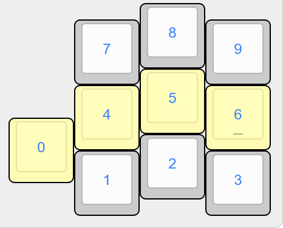

The [beakl](http://ieants.cc/beakl/?i=1) and [Callum's](https://github.com/qmk/qmk_firmware/blob/user-keymaps-still-present/users/callum/readme.md) layout have their own arrangements of digits on their respective layers; the latter, for example, has shuffled the order of numbers on the top row based on frequency/parity-based rules. However, it's not exactly clear what these rules are, and *Kyriel* uses a numpad-like layout instead of a row one anyway.

The following is a small set of suggested number layouts and the reasoning behind them - any one of them will likely work well (whereas a more unusual one will probably be more ergonomic and faster to use, but will also take longer to learn).

### Traditional

The obvious first choice, emulating the way digits are laid out on a real numpad. One could also flip it vertically to emulate a typical phone numpad instead.

### Asterisk

The default currently *Kyriel* uses this asterisk-shaped layout; It's the most comfortable and efficient one I found to date:

- `0` and `1` are by far used most-often, especially in programming (consider the numbers used most often during array indexing...)
- According to [Benford's law](https://en.wikipedia.org/wiki/Benford%27s_law) (which seems to hold in my personal experience, too), the more frequent numbers like `2`, `3` and `4` are assigned to the stronger fingers
- `5` retains its central position from the traditional layout at least partly.
- `6`, `7` and `8` are used less and therefore harder to learn, so they're arranged in the 'natural' order.
- Additionally, the even numbers form a `+`-shape around zero, while the odd numbers fill the corners in `×`-shape. This promotes learnability and simply makes the layout more intuitive without sacrificing any of functionality.
- Finally, `9`, which is used least often according to Benford's law, but actually used excessively in everyday cases like 99.99€ - so it's situated off the main grid, which is nevertheless compensated for by being on the homerow still.

*Note: some possible improvements could be swapping `3` and `2` or `2` and `4` or `6,`, `7` and `8` - at the cost of the satisfying asterisk shape and with unclear advantages.*

### Spiral (deprecated)

Mostly a prototype for the *-shaped layout above, and resembles a spiral going left from the central position and finally ending up at the sole little finger position (`4` and `3` might better be swapped).
