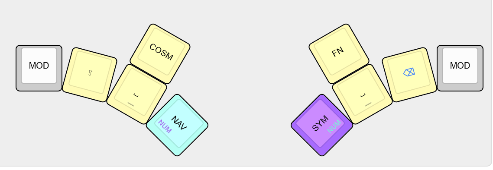

*Kyriel* is meant for keyboards with a total of 14 thumb keys, however, these can be reduced to 6 if needed. Even further 'compression' is possible as well, by either moving some keys to a different position (and potentially, layer) on the keyboard or utilising tap-hold keys to further combine SPC/BSP and the layers/dedicated modifiers (the latter defeats the purpose of the non-tap-hold MOD layers somewhat, however).

Each of the following 'steps' can be used on the main layout depending on the preferred number of thumb keys - from 7 to 3 or less per side.

The following is *Kyriel*'s default thumb key layout, with 7 keys on each side.

The `GAME` and `RST` positions are not the quickest to press and the keys aren't used too often anyway, so they can be removed/moved to empty space on some layer (like `FN`). 

Now there are 6 keys on each side:

`ESC` is moved (to `NAV` layer or replacing the dedicated `CTRL` position). Assuming the keys in the upper row are harder to reach than `SYM` and `NAV`, `NUM` is easier to press if it is moved to the so-called *ajust* layer - so `NUM` is turned on when `NAV` and `SYM` are activated together. 5 thumb keys per side:

(note that since the two buttons are symmetric, it is no longer obvious that the homerow modifiers on `NUM` are on the right side)

Now, the secondary layers `FN` and `COSM` have been moved to the *ajust* layers of `NAV+RMOD` and `SYM+LMOD` respectively, reducing the number of thumb keys to 4 per side:

This would be the optimal configuration for me, if not for the default 14-key one.

If further compression is needed, the second `SPC` and the dedicated `SHIFT` can be (re)moved; This results in thumb 3 keys per half:

(note: `SHIFT` was originally supposed to be a tap-hold variation of `SPC`; This is possible, but didn't work for me personally)

Even further compression (for 4-thumbkey keyboards like the ZSA Voyager) is possible by using combos, moving `MOD` keys to the outer pinkie columns if you have them, or even utilising tap hold combinations, to further overload the layer keys with single-press meanings and so on. This is a trade-off with *Kyriel*s main idea, which is to avoic tap-row functionality by utilising additional thumb/layer keys, but it is definitely doable.